[TOC]

# 软件安装和使用

## 编程

### vscode

```
sudo snap install --classic code
code
//无法输入输入中文，卸载后重新安装最新版本
//卸载
sudo snap remove --purge code
```

链接: https://pan.baidu.com/s/1d7f9VUvyFRKie2a8idzpUw?pwd=1234 提取码: 1234

```
//重新安装最新版本
sudo dpkg -i code.deb
code
```

#### vscode设置

```
//资源管理器文件夹出现折叠
打开设置搜索：Explorer:Compact Folders
取消勾选此项即可
```


#### vscode插件推荐

```
C/C++
C++ Intellisense
Todo Tree
Bookmarks
Git Graph
koroFileHeader //注释头
Switcher //头文件和源文件跳转
Project Manager for Java
python

```

```
// 头部注释
"fileheader.customMade": {
    // Author字段是文件的创建者 可以在specialOptions中更改特殊属性
    // 公司项目和个人项目可以配置不同的用户名与邮箱 搜索: gitconfig includeIf  比如: https://ayase.moe/2021/03/09/customized-git-config/
    // 自动提取当前git config中的: 用户名、邮箱
    "Author": "git config user.name && git config user.email", // 同时获取用户名与邮箱
    // "Author": "git config user.name", // 仅获取用户名
    // "Author": "git config user.email", // 仅获取邮箱
    // "Author": "OBKoro1", // 写死的固定值 不从git config中获取
    "Date": "Do not edit", // 文件创建时间(不变)
    // LastEditors、LastEditTime、FilePath将会自动更新 如果觉得时间更新的太频繁可以使用throttleTime(默认为1分钟)配置更改更新时间。
    "LastEditors": "git config user.name && git config user.email", // 文件最后编辑者 与Author字段一致
    // 由于编辑文件就会变更最后编辑时间，多人协作中合并的时候会导致merge
    // 可以将时间颗粒度改为周、或者月，这样冲突就减少很多。搜索变更时间格式: dateFormat
    "LastEditTime": "Do not edit", // 文件最后编辑时间
    // 输出相对路径，类似: /文件夹名称/src/index.js
    "FilePath": "Do not edit", // 文件在项目中的相对路径 自动更新
    // 插件会自动将光标移动到Description选项中 方便输入 Description字段可以在specialOptions更改
    "Description": "", // 介绍文件的作用、文件的入参、出参。
    // custom_string_obkoro1~custom_string_obkoro100都可以输出自定义信息
    // 可以设置多条自定义信息 设置个性签名、留下QQ、微信联系方式、输入空行等
    "custom_string_obkoro1": "", 
    // 版权声明 保留文件所有权利 自动替换年份 获取git配置的用户名和邮箱
    // 版权声明获取git配置, 与Author字段一致: ${git_name} ${git_email} ${git_name_email}
    "custom_string_obkoro1_copyright": "Copyright (c) ${now_year} by ${git_name_email}, All Rights Reserved. "
    // "custom_string_obkoro1_copyright": "Copyright (c) ${now_year} by 写死的公司名/用户名, All Rights Reserved. "
},
// 函数注释
"fileheader.cursorMode": {
    "description": "", // 函数注释生成之后，光标移动到这里
    "param": "", // param 开启函数参数自动提取 需要将光标放在函数行或者函数上方的空白行
    "return": "",
},
// 插件配置项
"fileheader.configObj": {
    "autoAdd": true, // 检测文件没有头部注释，自动添加文件头部注释
    "autoAddLine": 100, // 文件超过多少行数 不再自动添加头部注释
    "autoAlready": true, // 只添加插件支持的语言以及用户通过`language`选项自定义的注释
    "supportAutoLanguage": [], // 设置之后，在数组内的文件才支持自动添加
   // 自动添加头部注释黑名单
   "prohibitAutoAdd": [
      "json"
    ],
   "prohibitItemAutoAdd": [ "项目的全称禁止项目自动添加头部注释, 使用快捷键自行添加" ],
   "folderBlacklist": [ "node_modules" ], // 文件夹或文件名禁止自动添加头部注释
   "wideSame": false, // 头部注释等宽设置
   "wideNum": 13,  // 头部注释字段长度 默认为13
    "functionWideNum": 0, // 函数注释等宽设置 设为0 即为关闭
   // 头部注释第几行插入
    "headInsertLine": {
      "php": 2 // php文件 插入到第二行
    },
    "beforeAnnotation": {}, // 头部注释之前插入内容
    "afterAnnotation": {}, // 头部注释之后插入内容
    "specialOptions": {}, // 特殊字段自定义 比如: Author、LastEditTime、LastEditors、FilePath、Description、Date等
    "switch": {
      "newlineAddAnnotation": true // 默认遇到换行符(\r\n \n \r)添加注释符号
    },
    "moveCursor": true, // 自动移动光标到Description所在行
    "dateFormat": "YYYY-MM-DD HH:mm:ss",
    "atSymbol": ["@", "@"], // 更改所有文件的自定义注释中的@符号
    "atSymbolObj": {}, //  更改单独语言/文件的@
    "colon": [": ", ": "], // 更改所有文件的注释冒号
    "colonObj": {}, //  更改单独语言/文件的冒号
    "filePathColon": "路径分隔符替换", // 默认值： mac: / window是: \
    "showErrorMessage": false, // 是否显示插件错误通知 用于debugger
    "writeLog": false, // 错误日志生成
    "CheckFileChange": false, // 单个文件保存时进行diff检查
    "createHeader": false, // 新建文件自动添加头部注释
    "useWorker": false, // 是否使用工作区设置
    "designAddHead": false, // 添加注释图案时添加头部注释
    "headDesignName": "random", // 图案注释使用哪个图案 
    "headDesign": false, // 是否使用图案注释替换头部注释
    // 自定义配置是否在函数内生成注释 不同文件类型和语言类型
    "cursorModeInternalAll": {}, // 默认为false 在函数外生成函数注释
    "openFunctionParamsCheck": true, // 开启关闭自动提取添加函数参数
    "functionParamsShape": ["{", "}"], // 函数参数外形自定义 
    // "functionParamsShape": "no type" 函数参数不需要类型
    "functionBlankSpaceAll": {}, // 函数注释空格缩进 默认为空对象 默认值为0 不缩进
    "functionTypeSymbol": "*", // 参数没有类型时的默认值
    "typeParamOrder": "type param", // 参数类型 和 参数的位置自定义
    "NoMatchParams": "no show param", // 没匹配到函数参数，是否显示@param与@return这两行 默认不显示param
    "functionParamAddStr": "", // 在 type param 后面增加字符串 可能是冒号，方便输入参数描述
    // 自定义语言注释，自定义取消 head、end 部分
    // 不设置自定义配置language无效 默认都有head、end
    "customHasHeadEnd": {}, // "cancel head and function" | "cancel head" | "cancel function" 
    "throttleTime": 60000, // 对同一个文件 需要过1分钟再次修改文件并保存才会更新注释
     // 自定义语言注释符号，覆盖插件的注释格式
    "language": {
        // js后缀文件
        "js": {
            "head": "/$$",
            "middle": " $ @",
            "end": " $/",
            // 函数自定义注释符号：如果有此配置 会默认使用
            "functionSymbol": {
              "head": "/******* ", // 统一增加几个*号
              "middle": " * @",
              "end": " */"
            },
            "functionParams": "typescript" // 函数注释使用ts语言的解析逻辑
        },
       // 一次匹配多种文件后缀文件 不用重复设置
       "h/hpp/cpp": {
          "head": "/*** ", // 统一增加几个*号
          "middle": " * @",
          "end": " */"
        },
        // 针对有特殊要求的文件如：test.blade.php
        "blade.php":{
          "head": "<!--",
          "middle": " * @",
          "end": "-->",
        }
    },
 // 默认注释  没有匹配到注释符号的时候使用。
 "annotationStr": { 
      "head": "/*",
      "middle": " * @",
      "end": " */",
      "use": false
    },
}
```

#### python

```
“python3” 命令来自 Debian 软件包 python3
“python” 命令来自 Debian 软件包 python-is-python3
sudo ln -s /usr/bin/python3 /usr/bin/python
```

```
" ModuleNotFoundError: No module named 'tkinter' "的解决方法
sudo apt-get install tcl-dev tk-dev python3-tk
```


#### java

```
// 安装
sudo apt update
sudo apt install openjdk-8-jdk

// 选择默认版本
sudo update-alternatives --config java

//配置环境变量
sudo gedit /etc/profile 在文本末尾追加一下内容

export JAVA_HOME=/usr/lib/jvm/java-8-openjdk-amd64
export JRE_HOME=${JAVA_HOME}/jre
export CLASSPATH=.:${JAVA_HOME}/lib:${JRE_HOME}/lib
export PATH=.:${JAVA_HOME}/bin:$PATH

保存关闭，运行 source /etc/profile 使环境生效
java -version 查看当前版本
```

#### vim

```
//在vscode中 配置vim
//配置快捷键

"vim.leader":"<Space>",
"vim.normalModeKeyBindingsNonRecursive":[
{
"before":["<leader>","j"],
"after":["8","j"]
},
{
"before":["<leader>","k"],
"after":["8","k"]
},
{
"before":["<leader>","left"],
"after":["<C-w>","<"]
},
{
"before":
}

]
```


#### git

从[github](https://github.com/new)中创建空仓库

##### 添加SSHkey

[点击](https://github.com/settings/keys)进入界面

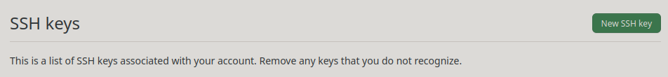

```
终端运行 ssh-keygen -t rsa -b 4096 -C  "邮箱"，回车3次

运行 cat ~/.ssh/id_rsa.pub 得到Key

点击 New SSH Key 输入 Title 和 Key 即可

终端运行 ssh -T git@github.com 输入yes显示Hi FrankFang! You've successfully authenticated, but GitHub does not provide shell access.说明添加ssh keys成功
```

##### vscode 配置 git

```
ctrl + shift + p输入git clone 显示
fatal: 无法访问 'https://github.com/.../....git/'：GnuTLS recv error (-110): The TLS connection was non-properly terminated.

在终端输入
git config --global --unset http.proxy 
git config --global --unset https.proxy
重新上一步即可
或者
sudo apt-get install gnutls-bin
git config --global http.sslVerify false
git config --global http.postBuffer 1048576000
```


#### html

##### 2天学习html计划

```
//第一天
Topic 1: HTML简介
    了解HTML的定义和作用
    学习HTML的版本和发展历程
Topic 2: HTML标签
    学习HTML标签的基本语法和结构
    掌握常用的文本标签和段落标签
    熟悉图像、超链接和列表标签的使用
Topic 3: HTML属性
    了解HTML属性的作用和语法
    学习如何设置元素的属性，如颜色、尺寸等
Topic 4: HTML表格
    学习创建表格的基本语法和结构
    掌握表格的行、列、单元格设置
    熟悉表格边框、对齐和合并单元格的技巧

//第二天
Topic 1: HTML表单
    学习创建表单的基本语法和结构
    掌握输入框、下拉列表和按钮等表单元素的使用
    了解表单验证和提交的方法
Topic 2: HTML嵌入内容
    学习如何嵌入多媒体内容，如音频、视频和地图
    熟悉使用iframe嵌入网页和外部内容
Topic 3: HTML语义化
    了解HTML语义化的概念和重要性
    学习如何正确使用语义化标签，如<header>、<footer>等
    掌握标记内容的结构和含义
Topic 4: HTML元素属性
    深入学习HTML元素的更多属性和用法
    探索常见的元素属性，如表单属性、图片属性等
```

##### 用vscode提高开发前端效率的9个插件

```
// JavaScript (ES6) Code Snippets
imp→	import moduleName from 'module';
imn→	import 'module';
imd→	import {  } from 'module';
ime→	import * as alias from 'module';
ima→	import { originalName as alias } from 'module';
rqr→	require('package');
req→	const packageName = require('packageName');
mde→	module.exports = {};
env→	export const exportVariable = localVariable;
enf→	export const functionName = (params) => {};
edf→	export default function test(params) {};
ecl→	export default class className {};
ece→	export default class className extends 			         baseclassName {};
fof→	for (const item of object) {}
fin→	for (const item in object) {}
anfn→	(params) => {}
nfn→	const name = (params) => {}
dob→	const {propertyName} = objectToDestruct;
dar→	const [propertyName] = arrayToDestruct;
sti→	setInterval(() => {}, intervalInms);
sto→	setTimeout(() => {}, delayInms);
prom→	return new Promise((resolve, reject) => {});
thenc→	.then((result) => {}).catch((err) => {});
cas→	console.assert(expression, object);
ccl→	console.clear();
cco→	console.count(label);
cdb→	console.debug(object);
cdi→	console.dir(object);
cer→	console.error(object);
cgr→	console.group('label');
cge→	console.groupEnd();
clg→	console.log(object);
clo→	console.log('object :>> ', object);
ctr→	console.trace(object);
cwa→	console.warn(object);
cin→	console.info(object);
clt→	console.table(object);
cti→	console.time(object);
cte→	console.timeEnd(object);

// CSS Peek
从HTML中的字符串中找到css/scss/less(类和id)。

// Auto Close Tag
自动闭合标签。

// Prettier — Code formatter
代码格式化工具。

// Auto Rename Tag
自动重命名标签。

// Path intellisense
路径智能感知。

// Better Comments
注释优化。

// Gitlens
可以方便地查看每行代码的最后修改者、最近的提交信息，甚至可以直接查看远程仓库上的相关代码片段。

// Live Server
实时服务器。
```

#### markdown

##### 用vscode 写markdown文件推荐安装的插件


##### 使用Markdown Preview Enhanced导出PDF时的princexml提示


会弹出


解决办法就是前往[官网](https://www.princexml.com/download/)下载安装即可。

### matlab

```
//变量名
1. 区分大小写
2. 长度不超过63位
3. 不能以数字开头，以数字下划线字母组成
//清除
clc
clear all
//注释
%
%%注释块%%
//字符串
‘字符’
//ascll码
abs('a')
//字符
char(97)
//长度,空格也算长度
length(str)
//矩阵
A=[1,2,3;2,3,4;3,4,5]
//转置
B=A'
//竖拉长
C=A(:)
//矩阵的逆
D=inv(A)
//3维10行5列0矩阵
E=zeros(10,5,3)
//rand(m,n)生成m行n列的均匀分布的伪随机数(分布在0~1)
//rand(m,n,'double')生成指定精度的均匀分布的伪随机数，参数还可以是‘single’
//rand(RandStream,m,n)利用指定的RandStream生成伪随机数
//randn生成标准正态分布的伪随机数（均值为0，方差为1）
//randi生成均匀分布的伪随机数
randi(iMax)在（0，iMax）生成均匀分布的伪随机数
randi(iMax,m,n)在（0，iMax）生成mXn型随机矩阵
randi([iMin,iMax],m,n)在（iMin,iMax）生成mXn型随机矩阵
//元胞数组
cell(1,6)
A[2] = eye(3)
```


### shell

#### 用户免密执行文件

```
如果普通用户需要切换到root用户且无需输入密码，则在root用户模式下执行命令：visudo
sudo visudo 或者 pkexec visudo
ubuntu ALL=(ALL) NOPASSWD:ALL  #ubuntu为用户名字 
ubuntu ALL=(ALL) NOPASSWD:/bin/mkdir,/bin/mv  #允许用户仅运行特定命令而不输入密码
//或者
sudo vi /etc/sudoers.d/ubuntu
```


#### 常用指令

```
tail [参数] [文件]  
参数：
-f 循环读取
-q 不显示处理信息
-v 显示详细的处理信息
-c<数目> 显示的字节数
-n<行数> 显示文件的尾部 n 行内容
--pid=PID 与-f合用,表示在进程ID,PID死掉之后结束
-q, --quiet, --silent 从不输出给出文件名的首部
-s, --sleep-interval=S 与-f合用,表示在每次反复的间隔休眠S秒 

实例
要显示 notes.log 文件的最后 10 行，请输入以下命令：
tail notes.log         # 默认显示最后 10 行
要跟踪名为 notes.log 的文件的增长情况，请输入以下命令：
tail -f notes.log
此命令显示 notes.log 文件的最后 10 行。当将某些行添加至 notes.log 文件时，tail 命令会继续显示这些行。 显示一直继续，直到您按下（Ctrl-C）组合键停止显示。
显示文件 notes.log 的内容，从第 20 行至文件末尾:
tail -n +20 notes.log
显示文件 notes.log 的最后 10 个字符:
tail -c 10 notes.log
```


#### ubuntu键盘输入记录

链接: https://pan.baidu.com/s/1gcDU7f8yN3aV69K-PPlkHw?pwd=1234 提取码: 1234

```
logkeys keylogger - installation instructions
=============================================

Provided your GNU/Linux distribution doesn't include logkeys package
in its repositories, manual installation of logkeys from source is as
easy as cloning this repo or downloading a zip of the
source (<https://github.com/kernc/logkeys/archive/master.zip>),
unzipping, configuring, and building.

Prerequisites
-------------

You need some tools to build the code from source:

    # On Debian-based distros
    apt install build-essential autotools-dev autoconf kbd

    # On openSUSE
    zypper install automake gcc-c++ kbd

    # on Fedora/Redhat/CentOS
    dnf install automake make gcc-c++ kbd

    # on ArchLinux
    pacman -S base-devel kbd


Build and Install
-----------------

    $ unzip logkeys-master.zip     # or use git clone
    $ cd logkeys-master

    $ ./autogen.sh     # generate files for build
    $ cd build         # keeps the root and src dirs clean
    $ ../configure

    $ make
    $ su               # get root to install in system
    $ make install     # installs binaries, manuals and scripts

To uninstall logkeys, remove accompanying scripts and manuals:

    $ make uninstall    # in the same build dir

See README file for usage instructions, troubleshooting and other notes.

Cleaning after a build
----------------------

`autogen.sh` and `configure` generate many files which are ignored by
git.  All of these files can be removed from the project, e.g. to
force a clean build, with the following:

    git clean -xdf
```

```
logkeys：键盘记录主程序文件。
llk：用于启动logkeys守护进程。
llkk：用于停止logkeys守护进程。
logkeys k：杀logkeys过程。
logkeys -s: 启动应用程序日志键。
logkeys –help或man logkeys: 获取帮助。


//获取键盘event信息
cat /proc/bus/input/devices

//安装console-data
sudo apt-get install console-data

//选择错时，重新配置keymap
sudo dpkg-reconfigure console-data

//查看当前系统支持的keymaps
find /usr/share/keymaps/ -type f

//加载对应的keymap
sudo loadkeys typekeymap //typekeymap替换成其它对应的
```

```
#!/bin/bash

sudo /usr/local/bin/logkeys -s -m /usr/share/keymaps/en_US_ubuntu_1204.map  -o /var/log/logkeys.log 

sudo /usr/local/bin/logkeys logkeys --start --output  /var/log/logkeys.log
```

补充

```
//启动logkeys
touch test.log
sudo chmod 777 test.log
sudo chmod 777 /usr/local/bin/logkeys
sudo logkeys -s -m /usr/share/keymaps/en_US_ubuntu_1204.map  -o /var/log/logkeys.log

//其中-s启动logkeys deamon， -m是键盘映射文件的路径， -o是日志输出文件。 Logkeys现在应该开始将捕获键击转   储到定义的日志文件（人类可读）。 

//终止程序logkeys
sudo logkeys -k

//启动时自动启动： 
sudo vim /etc/systemd/system/logkeys.service
//添加如下内容
[Unit]
Description=My logkeys Service
After=network.target
[Service]
User=user
ExecStart=/usr/local/bin/logkeys -s -m /usr/share/keymaps/en_US_ubuntu_1204.map  -o /var/log/logkeys.log 
[Install]
WantedBy=multi-user.target

//保存并关闭该文件，然后启动该服务并将其设置为开机自启：
sudo systemctl daemon-reload
sudo systemctl start logkeys.service
sudo systemctl enable logkeys.service

//开机自启后进行检查service服务状态
sudo systemctl status logkeys.service
//若自启成功，执行以下命令
sudo /usr/local/bin/logkeys --start --output  /var/log/logkeys.log

//如果需要停止该服务并禁用开机自启，可以使用以下命令：
sudo systemctl stop logkeys.service
sudo systemctl disable logkeys.service
```

#### ps -aux | grep 用法

```
ps -aux输出格式：
USER PID %CPU %MEM VSZ RSS TTY STAT START TIME COMMAND

USER: 行程拥有者
PID: pid（进程号）
%CPU: 占用的 CPU 使用率
%MEM: 占用的记忆体使用率
VSZ: 占用的虚拟记忆体大小
RSS: 占用的记忆体大小
TTY: 终端的次要装置号码 (minor device number of tty)
STAT: 该行程的状态，linux的进程有5种状态：
D 不可中断 uninterruptible sleep (usually IO)
R 运行 runnable (on run queue)
S 中断 sleeping
T 停止 traced or stopped
Z 僵死 a defunct (”zombie”) process
注: 其它状态还包括W(无驻留页), <(高优先级进程), N(低优先级进程), L(内存锁页).
START: 行程开始时间
TIME: 执行的时间
COMMAND:所执行的指令
```

#### 杀死进程

```
//使用kill命令杀死进程
kill <PID>

//使用pkill命令杀死进程
pkill <进程名>

//使用fuser命令杀死进程
fuser -k <路径/文件名>
```


#### 解压

```
// filename.tar.xz
// -f参数用于指定要解压的文件名。
tar -xf filename.tar.xz 
//进入解压目录
cd filename
//安装
./configure
make
sudo make install

//filename.tar.bz2
tar -jxvf filename.tar.bz2
```

推荐在code中安装插件shellman和shellcheck进行智能补全和语法检查。

#### 命令行打开网页的3种方法

```
// links
sudo apt install links
links *.html

// w3m
sudo apt install w3m
w3m *.html

// lynx
sudo apt install lynx
lynx *.html
```


#### crontab

```
crontab –e     //修改 crontab 文件，如果文件不存在会自动创建。
crontab –l      //显示 crontab 文件。
crontab -r      //删除 crontab 文件。
crontab -ir     //删除 crontab 文件前提醒用户。

service cron status     //查看crontab服务状态
service cron start     //启动服务 
service cron stop     //关闭服务 
service cron restart     //重启服务 
service cron reload     //重新载入配置

*　　*　　*　　*　　*　　command
分  时　 日　 月　 周　  命令
第1列表示分钟 00～59 每分钟用*或者 */1表示
第2列表示小时 00～23（0表示0点）
第3列表示日期 01～31
第4列表示月份 01～12
第5列标识号星期 0～6（0表示星期天）
第6列要运行的命令
此外每一列除了数字，还可以有这些符号，其含义如下所示：
*        代表任何时间，比如第一个 * 就代表一小时中的每分钟都执行
,        代表不连续的时间，比如 0 8,12,16 * * * 代表每天8，12，16点0分执行
-        代表连续的时间范围，比如0 5 * * 1-6 代表在周一到周六凌晨5点0分执行
*/n     代表每个多久执行一次，比如*/10 * * * *代表每隔10分钟执行一次

示例
1、在 凌晨00:10运行
10 0 * * * sh test.sh
2、每个工作日23:59都进行备份作业。
59 23 * * 1,2,3,4,5 sh test.sh   
或者  
59 23 * * 1-5 sh test.sh
3、每分钟运行一次命令
*/1 * * * * sh test.sh
4、每个月的1号 14:10 运行
10 14 1 * * sh test.sh
5、每10小时定时请求一个地址
0 */10 * * * /usr/bin/curl http://www.aaa.com/index.php
注意，一般最好不要同时采用几号和每周几，可能会出现混淆；
正确、错误日志的输出是否写入到文件方法
1.不输出任何内容（建议使用方法一）
*/1 * * * * /root/XXXX.sh >/dev/null 2>&1 
或
*/1 * * * * /root/XXXX.sh &>/dev/null    //&表示任何内容
2.将正确和错误日志都输出到 /tmp/load.log
*/1 * * * * /root/XXXX.sh > /tmp/load.log 2>&1
3.只输出正确日志到 /tmp/load.log
*/1 * * * * /root/XXXX.sh > /tmp/load.log
或
*/1 * * * * /root/XXXX.sh 1> /tmp/load.log    //1可以省略
4.只输出错误日志到 /tmp/load.log
*/1 * * * * /root/XXXX.sh 2> /tmp/load.log
部分解释:
/dev/null 代表空设备文件
> 代表重定向到哪里
1 表示stdout标准输出，系统默认值是1，所以">/dev/null"等同于"1>/dev/null"
2 表示stderr标准错误
& 表示等同于的意思，2>&1，表示2的输出重定向等同于1
```


#### 注释

行注释

```
# 注释内容
```

块注释

```
:<<!
注释内容
!
```

#### 命令行中的数学

变量

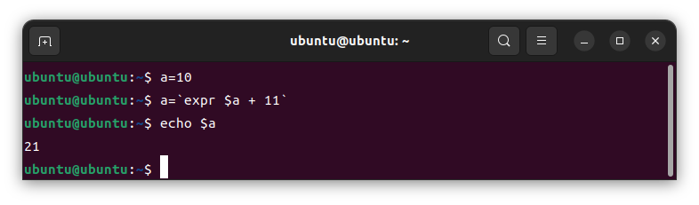

加减乘除取模

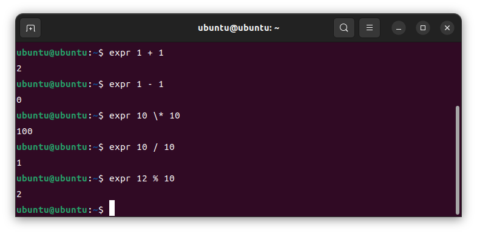

eg:王红计划用一周的时间看完一本224页的书，实际前3天看了99页。照这样计算，她能在一周内看完吗?

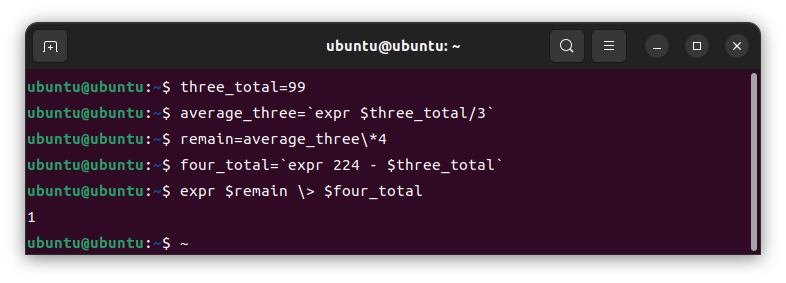

大于，小于，大于等于，小于等于，等于

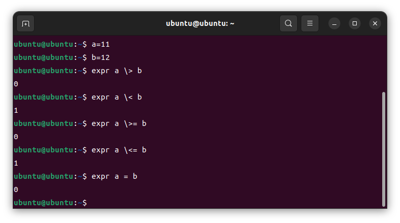

factor 因子

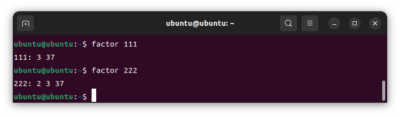

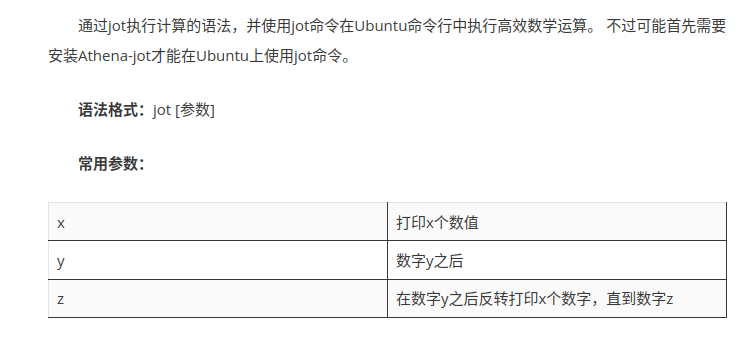

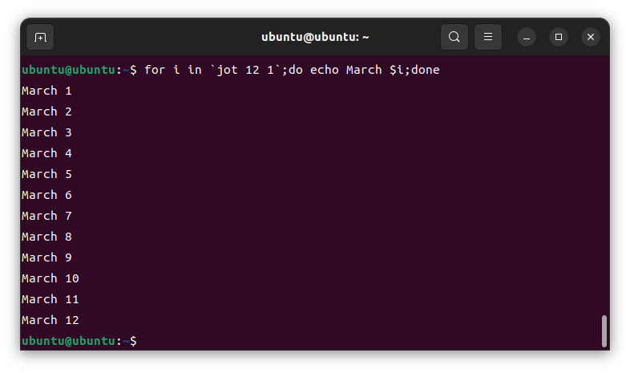

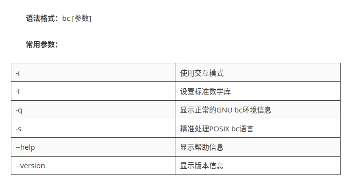

 bc 下的计算

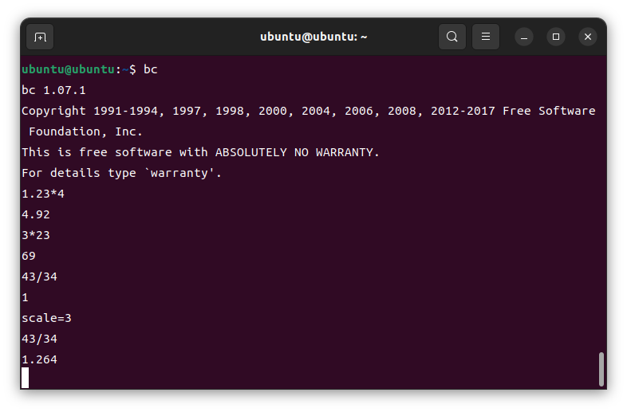


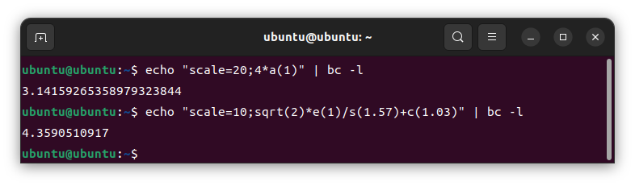

bash 中 +、-、*、/、++、--、**、%、 在双括号内运算

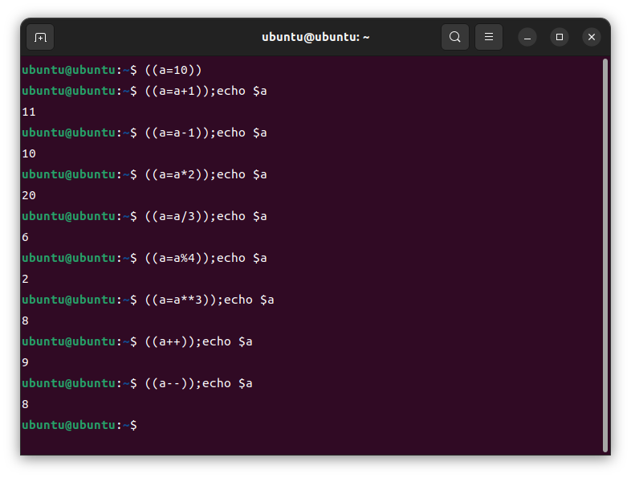

#### 统计命令执行时间

```
time ls

实际时间（real time）：指命令从开始到结束的实际耗时。
用户 CPU 时间（user time）：指命令在用户态运行的 CPU 时间，不包括系统调用时间。
系统 CPU 时间（system time）：指命令在内核态运行的 CPU 时间，包括系统调用时间。


timeout <持续时间> <命令>：若该命令在 <持续时间> 后仍在运行，则将其杀死。
<持续时间> 是一个浮点数，且可以添加下列后缀：
"s" 代表秒（默认）、"m" 代表分、"h" 代表小时、"d" 代表天。
若 <持续时间> 为 0，则禁用对应的超时设置。

ulimit [-SHabcdefiklmnpqrstuvxPT] [限制]
选项：
      -S	使用 "软" (soft) 资源限制
      -H	使用 "硬" (hard) 资源限制
      -a	报告当前的所有限制
      -b	套接字缓冲区大小
      -c	创建的核心文件的最大大小
      -d	一个进程的数据段的最大大小
      -e	调度优先级 (nice) 的最大值
      -f	shell 及其子进程可以写的最大文件大小
      -i	可以挂起的最大信号数量
      -k	分配给此进程的最大 kqueue 数量
      -l	一个进程可以锁定的最大内存大小
      -m	驻留集的最大大小
      -n	打开的文件描述符的最大个数
      -p	管道缓冲区大小
      -q	POSIX 消息队列的最大字节数
      -r	实时调度的最大优先级
      -s	最大栈大小
      -t	最大的 CPU 时间，以秒为单位
      -u	最大用户进程数
      -v	虚拟内存大小
      -x	文件锁的最大数量
      -P	伪终端的最大数量
      -R	实时进程阻塞前可运行的最大时间
      -T	最大线程数量
    并非所有选项都在所有系统上可用。
    如果提供了 <限制>，则它将成为指定的资源的新的值；特殊的 <限制> 值为
    "soft"、"hard" 和 "unlimited"，分别表示当前的软限制、当前的硬限制，
    以及无限制。否则，打印指定资源的当前限制值。如果未提供选项，则假定
    为 -f。
    限制值的单位都是 1024 字节，除了 -t 单位是秒，-p 单位是 512 字节，
    -u 为未经缩放的进程数量。   
    退出状态：
    返回成功，除非使用了无效的选项，或者有错误发生。
```

#### 终端计时器

```
sudo gedit /etc/hosts
//在文本中添加下面四行
185.199.108.133 raw.githubusercontent.com
185.199.109.133 raw.githubusercontent.com
185.199.110.133 raw.githubusercontent.com
185.199.111.133 raw.githubusercontent.com
//安装
sudo apt install curl
curl -o ~/timer https://raw.githubusercontent.com/rlue/timer/master/bin/timer
sudo chmod +x ~/timer
sudo mv timer /usr/bin
//使用
//计时器设置为10秒
timer -d 10

//计时器设置为10分
timer 10

//获取帮助
timer -h

//等待10分
sleep 10m

//等待10秒
sleep 10s

//等待10小时
sleep 10h

//等待10天
sleep 10d
```

#### sort

    -u: 去除重复行
    -r: 降序排列，默认是升序
    -o: 将排序结果输出到文件中，类似重定向符号
    -n: 以数字排序，默认按字符排序
    -t； 分隔符
    -k: 第N列
    -b: 忽略前导空格
    -R: 随机排序，每次运行的结果均不同

#### Shell 文件或目录操作符（-e、-d、-f、-r、-w、-x）

```
-e 判断对象是否存在(Exist)，若存在则结果为真
-d 判断对象是否为目录(Directory)，是则为真
-f 判断对象是否为一般文件(File)，是则为真
-r 判断对象是否有可读(Read)权限，是则为真
-w 判断对象是否有可写(Write)权限，是则为真
-x 对象是否有可执行(eXcute)权限，是则为真
```


### latex

#### texlive && texstudio

```
sudo apt install texlive-full
sudo apt install texstudio
```

### markdown

#### typora

// 用户账号随便输入即可激活

链接: https://pan.baidu.com/s/17BuIJh4mi0Ugx4NLfrg4UA?pwd=1234 提取码: 1234

```
// 在下载文件目录下打开终端输入
sudo dpkg -i typora_1.5.10-1_amd64.deb
```

## 思维导图

### 知犀思维导图

链接: https://pan.baidu.com/s/18MJzC3miLkWKqT1vsMgAHg?pwd=1234 提取码: 1234

```
sudo dpkg -i zhixilinux.deb
```
## qtcreator
```
wget https://download.qt.io/archive/qt/5.12/5.12.9/qt-opensource-linux-x64-5.12.9.run
chmod +x qt-opensource-linux-x64-5.12.9.run
sudo ./qt-opensource-linux-x64-5.12.9.run
//登录不了报错，设置改为无代理
Warning: Network error: [ QNetworkReply::NetworkError(AuthenticationRequiredError) ] "Authentication failed."
//建立软连接，终端输入qtcreator即可启动
sudo ln -s /opt/Qt5.12.9/Tools/QtCreator/bin/qtcreator.sh /usr/bin/qtcreator
```


## matlab

链接: https://pan.baidu.com/s/1DWZYyLOuqrEI8venk6d1MQ?pwd=1234 提取码: 1234

1. 将文件下载到/home/ubuntu/下载/，然后Ctrl+Alt+T打开终端

```
//创建DVD文件夹
sudo mkdir /home/ubuntu/下载/Linux_matlab/DVD
//挂载dvd1
sudo mount -t auto -o loop /home/ubuntu/下载/Linux_matlab/R2018a_glnxa64_dvd1.iso /home/ubuntu/下载/Linux_matlab/DVD/
//安装dvd1
sudo /home/ubuntu/下载/Linux_matlab/DVD/install
//选择文件安装秘钥→下一步
//安装密钥在文件夹Crack/readme.txt中
//弹出dvd1
sudo umount /home/ubuntu/下载/Linux_matlab/DVD/
//挂载dvd2
sudo mount -t auto -o loop /home/ubuntu/下载/Linux_matlab/R2018a_glnxa64_dvd2.iso /home/ubuntu/下载/Linux_matlab/DVD/
//点击上图中的”OK“继续安装 (一切默认无需修改)
//安装完后弹出dvd2
sudo umount /home/ubuntu/下载/Linux_matlab/DVD/

//激活
sudo /usr/local/MATLAB/R2018a/bin/matlab
//不使用Internet的情况下手动激活→选择Crack文件中的 license_standalone.lic 文件
然后在终端输入:
sudo cp /home/ubuntu/下载/Linux_matlab/Crack/R2018a/bin/glnxa64/matlab_startup_plugins/lmgrimpl/libmwlmgrimpl.so /usr/local/MATLAB/R2018a/bin/glnxa64/matlab_startup_plugins/lmgrimpl
sudo cp /home/ubuntu/下载/Linux_matlab/Crack/license_standalone.lic /usr/local/MATLAB/R2018a/licenses/
//创建快捷键
  sudo gedit /usr/share/applications/Matlab2018a.desktop
  //输入
    [Desktop Entry] 
    Encoding=UTF-8
    Name=Matlab 2018a
    Comment=MATLAB
    Exec=/usr/local/MATLAB/R2018a/bin/matlab
    Icon=/usr/local/MATLAB/R2018a/toolbox/shared/dastudio/resources/MatlabIcon.png
    Terminal=true
    Type=Application
    Categories=Application
    
//设置环境变量
sudo vim ~/.bashrc
# added by matlab2018a
export PATH=/usr/local/MATLAB/R2018a/bin:$PATH
source ~/.bashrc
//之后终端直接输入matlab即可进入matlab工作环境
```

## 字体
```
//在字体目录刷新字体
sudo fc-cache -f -v
```

```
//安装字体管理程序
sudo apt-get install font-manager
//卸载字体管理器
sudo apt-get remove font-manager
```


## 压缩

### tar

```
//查看file大小
du -sh file
//查看当前路径下各个文件的大小
du -h 
```

```
tar [-cxtzjvfpPN] 文件名
参数：
-c ：建立一个打包文件(create)
-x ：解开一个打包文件
-t ：查看tarfile里面的文件
c/x/t仅能同时存在一个
-z ：是否同时使用gzip来压缩
-j ：是否同时具有bzip2来压缩
-v ：压缩的过程中显示文件,这个很常用，但不建议用在背景执行过程
-f ：指定文件名
f 之后要立即接档名，不能再加参数(即f要放到最后)
-p ：使用原文件的原来属性(属性不会依据使用者而变)
-P ：使用绝对路径来压缩
-N ：比后面接的日期(yyyy/mm/dd)还要新的才会被打包进新建的文件中！
–exclude FILE：在压缩的过程中，不要将 FILE 打包！

范例：
//只打包
tar -cvf 打包后的文件名 打包前的文件名
//以tar.gz格式打包并压缩
tar -czvf 打包后的文件名 打包前的文件名
//以tar.bz2格式打包并压缩
tar -cjvf 打包后的文件名 打包前的文件名
//将压缩文件file.tar.gz分割成多个20M小文件file.tar.gz.part
split -b 20M file.tar.gz file.tar.gz.part
```

## 网盘

### 坚果云

链接: https://pan.baidu.com/s/1O9W-mgx-MAaVGvoSB-nkBg?pwd=1234 提取码: 1234

```
sudo dpkg -i nautilus_nutstore_amd64.deb
```

### 百度网盘

链接: https://pan.baidu.com/s/16Drk4EWXIrs5NK1Nl1NRHA?pwd=1234 提取码: 1234

```
sudo dpkg -i baidunetdisk_4.17.7_amd64.deb
```

## 输入法

### 搜狗输入法

```
// 先安装fcitx
sudo apt install fcitx-bin
sudo apt-get install fcitx-table
// 安装依赖
sudo apt install libqt5qml5 libqt5quick5 libqt5quickwidgets5 qml-module-qtquick2
sudo apt install libgsettings-qt1
```

​	链接: https://pan.baidu.com/s/1NDs5Jtlj3n83Aw2ndsrlrA?pwd=1234 提取码: 1234

```
sudo dpkg -i sogoupinyin_4.2.1.145_amd64.deb
sudo apt -f install
```

安装完后到语言支持设置fcitx，[具体详情请点击参考](https://pinyin.sogou.com/linux/help.php?eqid=e89583510011e72500000005645a7a53)

## 浏览器

#### 火狐浏览器

```
//命令行打开网页
firefox *.html
//打开网页视频自动静音
火狐设置→隐私和安全→自动播放设置→所有网站的默认值改为允许音频和视频→保存更改
```
## 阅读器
### okular
```
sudo apt install okular
//在vscode中配置反向搜索
code --goto %f:%l
//使用正向搜索时，让光标停在源码的某处，然后按快捷键 Ctrl+Alt+J 快捷键就能实现正向搜索。
//在Okular中，使用反向搜索时要按住 Shift 键同时用鼠标单击PDF文件
```
```
//settings.json
{
    // Latex configuration
        "latex-workshop.latex.recipes": [
        {
            "name": "xelatex",
            "tools": [
                "xelatex"
            ],
        },
        {
            "name": "pdflatex",
            "tools": [
                "pdflatex"
            ]
        },
        {
            "name": "xe->bib->xe->xe",
            "tools": [
                "xelatex",
                "bibtex",
                "xelatex",
                "xelatex"
            ]
        },
        {
            "name": "pdf->bib->pdf->pdf",
            "tools": [
                "pdflatex",
                "bibtex",
                "pdflatex",
                "pdflatex"
            ]
        }
    ],
    "latex-workshop.latex.tools": [
        {
        // 编译工具和命令
        "name": "xelatex",
        "command": "xelatex",
        "args": [
            "-synctex=1",
            "-interaction=nonstopmode",
            "-file-line-error",
            "-pdf",
            "%DOCFILE%"
        ]
        },
        {
        "name": "pdflatex",
        "command": "pdflatex",
        "args": [
            "-synctex=1",
            "-interaction=nonstopmode",
            "-file-line-error",
            "%DOCFILE%"
        ]
        },
        {
        "name": "bibtex",
        "command": "bibtex",
        "args": [
            "%DOCFILE%"
        ]
        }
    ],
    "latex-workshop.latex.clean.fileTypes": [
        "*.aux",
        "*.bbl",
        "*.blg",
        "*.idx",
        "*.ind",
        "*.lof",
        "*.lot",
        "*.out",
        "*.toc",
        "*.acn",
        "*.acr",
        "*.alg",
        "*.glg",
        "*.glo",
        "*.gls",
        "*.ist",
        "*.fls",
        "*.log",
        "*.fdb_latexmk"
    ],
    "latex-workshop.latex.outDir":"%DIR%",
    "latex-workshop.view.pdf.viewer":"external",
    "latex-workshop.view.pdf.external.viewer.command": "okular",
    "latex-workshop.view.pdf.external.viewer.args": 
    [
        "--unique",
        "%PDF%"
    ],
    "latex-workshop.view.pdf.external.synctex.command": "okular",
    "latex-workshop.view.pdf.external.synctex.args": [
        "--unique",
        "%PDF%#src:%LINE%%TEX%"
    ],
}
```


## 播放器

```
//默认播放器播放MP4黑屏
//ubuntu-restricted-extras 是一个包含各种基本软件的软件包
sudo apt install ubuntu-restricted-extras
//使用FFmpeg安装解码器
sudo snap install ffmpeg
```


### rhythmbox

```
//卸载
sudo apt remove --purge rhythmbox
sudo apt autoremove
```

### vlc 

```
//安装
sudo apt install vlc 
//卸载
sudo apt remove --purge vlc*
sudo apt autoremove
```

### sox

```
//安装
sudo apt install sox
sudo apt install libsox-fmt-all
```

### moc

```
//安装
sudo apt install moc
mocp

空格键和p: 暂停和播放
s:停止播放
左右箭头：快退快进
n:下一曲
q:进入后台播放
g:搜索歌曲
<和,:降低声音%1和5%
>和.:提高声音1%和5%
h:快捷键
```

### cmus

```
//安装
sudo apt-get install cmus
cmus

F5:文件浏览
左右箭头：快退快进
q:退出
h:快退5秒
<和,:快退1分
>和.:快进1分
l:快进5秒
j:向下翻
k:向上翻
g:定位目录
c:暂停和播放
?和/：搜索
空格键：确认播放
```

### mplayer

```
//安装
sudo apt install mplayer
```

## 图片

```
//命令行打开图片
eog /path/to/image.jpg
```


## 录屏

### kazam

```
//安装
sudo apt install kazam
sudo gedit /etc/gdm3/custom.conf 
//第7行 #WaylandEnable=false取消注释，保存退出
sudo systemctl restart gdm3
```

## office

### libreoffice

```
//卸载
su root
apt-get remove --purge libreoffice*
apt autoremove
// 切回原用户
exit 或者 Ctrl + D
```

### wps

链接: https://pan.baidu.com/s/1ctqVC7W0f4I8c_froXi5Ng?pwd=1234 提取码: 1234

```
//安装
sudo dpkg -i wps-office_11.1.0.11711_amd64.deb
```

// 提示缺少字体下载字体包

链接: https://pan.baidu.com/s/14EMThRhQImaH8j3-R2iIWg?pwd=1234 提取码: 1234

```
// 在下载目录终端输入
sudo unzip wps_symbol_fonts.zip -d wps_symbol_fonts
cd wps_symbol_fonts
// 依次双击每个.ttf文件进行安装
```

## 词典

### ubuntu 命令行查词yd

链接: https://pan.baidu.com/s/1RskaJa08QEF0pele3HPc3Q?pwd=1234 提取码: 1234

```
// 安装npm
tar -xvf node-v6.9.5-linux-x64.tar.xz
sudo mv node-v6.9.5-linux-x64 /usr/local/node
sudo ln -s /usr/local/node/bin/node /usr/local/bin/node
sudo ln -s /usr/local/node/lib/node_modules/npm/bin/npm-cli.js /usr/local/bin/npm
// 安装有道
sudo apt install npm
npm install yddict -g
//  配置
sudo ln -s  /usr/local/node/lib/node_modules/yddict/index.js /usr/local/bin/yd
```

### eudic

链接: https://pan.baidu.com/s/18dLm2JCsaFIPdEl7lla7jw?pwd=1234 提取码: 1234

```
//安装
sudo dpkg - i eudic.deb
```

### goldendict

```
//安装
sudo apt-get install goldendict
```

// 词典数据：《简单释义比例词典》链接: https://pan.baidu.com/s/1EheNb8rTjwphxzrjqInkFA?pwd=1234 提取码: 1234

《简明英汉字典增强版》链接: https://pan.baidu.com/s/1kixRmcB-WRzeC3hwxHTfBQ?pwd=1234 提取码: 1234

## 打字练习

### typespeed

```
//安装
sudo apt install typespeed
typespeed
```

### gtypist

```
//安装
sudo apt install gtypist
gtypist
```

## 邮箱

### 命令行安装和发送邮件

```
//安装
sudo apt install mailutils
sudo apt install ssmtp
sudo apt install postfix
//配置postfix
sudo dpkg-reconfigure postfix
//查看安装版本
sudo postconf mail_version


//163邮箱配置
sudo vim /etc/ssmtp/ssmtp.conf
//修改
root=1995195@163.com
mailhub=smtp.163.com:465
AuthUser=1995195@163.com
AuthPass=APYDOSTDPDUOEEHQ # 这个密码不是邮箱的密码，而是网易邮箱的授权码
UseTLS=Yes

sudo vim /etc/ssmtp/revaliases
//添加
ubuntu:18586750391@163.com:smtp.163.com:465 //ubuntu为当前用户
//如果发送邮件失败，tail -f命令查看日志
echo 'Here is the message body.' | mail -s "Test email from ubuntu server!" 18586750391@163.com 
tail -f /var/log/mail.err 

//qq邮箱配置
sudo vim /etc/ssmtp/ssmtp.conf
//修改

root=1432132015@qq.com
mailhub=smtp.qq.com:465
AuthUser=1432132015@qq.com
AuthPass=kkvvgghdyzfwiahh
UseTLS=Yes

sudo vim /etc/ssmtp/revaliases
//添加
ubuntu:1432132015@qq.com:smtp.qq.com:465 //ubuntu为当前用户
//如果发送邮件失败，tail -f命令查看日志
echo 'Here is the message body.' | mail -s "Test email from ubuntu server!" 1432132015@qq.com 
tail -f /var/log/mail.err 

//总结：两个配置
sudo vim /etc/ssmtp/ssmtp.conf
sudo vim /etc/ssmtp/revaliases

//发送邮件失败
cat /var/log/mail.err
Dec 30 09:41:47 ubuntu sSMTP[9549]: 553 Mail from must equal authorized user
```

```
一. 安装
　　1. sendmail必须先要安装两个包
　　　　（1）sudo apt-get install sendmail
　　　　（2）sudo apt-get install sendmail-cf
　　2. ubuntu下最常使用的是mail功能，需要安装mailutils
　　　　sudo apt-get install mailutils
　　3. 若需要使用带“附件”的功能，还需要安装sharutils
　　　　sudo apt-get install sharutils
　　4. 测试
　　　　输入命令：
　　　　ps aux | grep sendmail
 　　	 若显示以下内容，则表明安装成功！！！
```

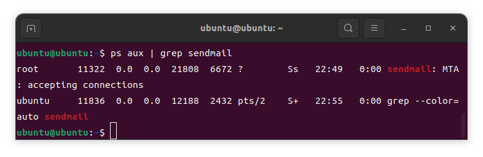

```
二. 配置
　　默认情况下，sendmail只会为本机用户发送邮件，若要将它扩展到整个Internet，则要进行以下配置。
　　打开sendmail的配置宏文件：/etc/mail/sendmail.mc
　　若仅仅在普通用户（非root权限）打开，如果没有在开头加“sudo”，则没有办法对该配置进行修改，此时需要使用命令：
　　　　sudo vi /etc/mail/sendmail.mc
　　将Addr=127.0.0.1改为0.0.0.0，表明可以连接到任何服务器上
　　生成新的配置文件：
代码 
	sudo su
    cd /etc/mail  
    mv sendmail.cf sendmail.cf~      //做一个备份  
    m4 sendmail.mc > sendmail.cf   //>的左右有空格，提示错误没有安装sendmail-cf  
三. 测试发送邮件
　　常用的发送邮件方式有以下几种：
　　　　1.如何写一般的邮件： mail test@qq.com  Cc 编辑抄送对象，Subject:邮件主题，输入回车，邮件正文后，按Ctrl-D结束
　　　　2.快速发送方式： echo "邮件正文" | mail -s 发送主题 -a 附件路径及名称 邮件地址
　　　　3.以文件内容作为邮件正文来发送： mail -s test test@126.com < test.txt
　　　　4.发送带附件的邮件： uuencode 附件 附件名| mail -s "邮件标题" 收信人
```


### Thunderbird


**您的全名：**李四

**电子邮件地址：**163邮箱，QQ邮箱

**密码：**到163邮箱设置打开服务即可得到163邮箱密码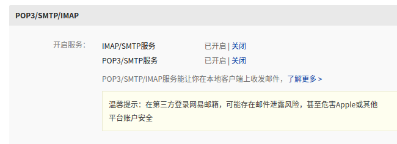

或QQ邮箱设置账号打开服务即可得到QQ邮箱密码


## 


